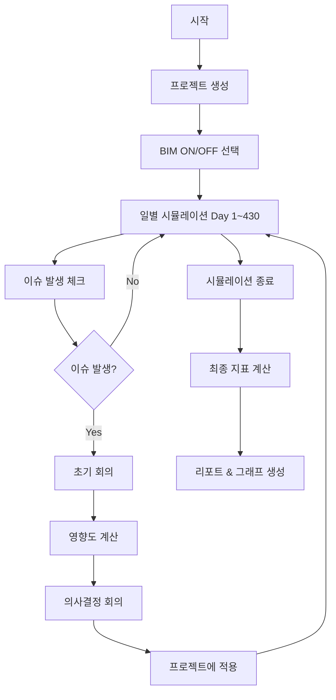

# 🏗️ 건설 시뮬레이션 시스템 매뉴얼

> BIM 적용 효과를 정량적으로 분석하는 건설 프로젝트 시뮬레이션

---

## 📋 목차

1. [시스템 개요](#-시스템-개요)
2. [파일 구조](#-파일-구조)
3. [시뮬레이션 흐름](#-시뮬레이션-흐름)
4. [핵심 지표 시스템](#-핵심-지표-시스템)
5. [현실과의 차이점](#-현실과의-차이점)
6. [개선 방안](#-개선-방안)
7. [실행 가이드](#-실행-가이드)

---

## 🎯 시스템 개요

### 목적
- **BIM ON/OFF 비교**: 전통 방식 vs BIM 적용 시 성과 비교
- **정량적 분석**: 공사 기간, 비용, 이슈 탐지율 측정
- **품질 수준별 효과**: BIM 품질에 따른 차이 분석

### 핵심 개념
```
BIM OFF (전통 방식)
├─ 2D 도면 기반
├─ 이슈 조기 탐지 불가
└─ 높은 지연 & 비용

BIM ON (BIM 적용)
├─ 3D BIM 모델 기반
├─ 조기 탐지 가능
├─ 품질 수준: Excellent > Good > Average > Poor
└─ 지연 & 비용 절감
```

### 시뮬레이션 방식
- **27개 이슈 카드**: 실제 건설 현장 이슈 (설계 오류, 간섭, 자재 지연 등)
- **CPM 기반**: Critical Path Method로 실무적 지연 계산
- **협상 시스템**: 발주자, 설계자, 시공사, 감리자 간 협상으로 지연/비용 결정
- **재현성 보장**: 랜덤 시드로 동일 조건 비교

---

## 📁 파일 구조

```
construction_simulation/
│
├── 🎮 main.py                       # 메인 실행 파일
│
├── ⚙️ config/                        # 설정
│   ├── project_config.py            # 프로젝트 기본 설정
│   ├── bim_quality_config.py        # BIM 품질 지표 설정
│   ├── project_templates.py         # 프로젝트 템플릿
│   └── work_dependencies.py         # CPM 공종 의존성
│
├── 📦 models/                        # 데이터 모델
│   ├── project.py                   # 프로젝트 상태 관리
│   ├── bim_quality.py               # BIM 품질 계산
│   └── financial.py                 # 금융 비용 (PF 대출)
│
├── 🔧 simulation/                    # 시뮬레이션 엔진
│   ├── simulation_engine.py         # 메인 엔진
│   ├── issue_manager.py             # 이슈 발생 관리
│   ├── impact_calculator.py         # ⭐ 핵심: 영향도 계산
│   ├── delay_calculator.py          # CPM 지연 계산
│   ├── meeting_coordinator.py       # 회의 시뮬레이션
│   └── negotiation_system.py        # 협상 시스템
│
├── 👥 agents/                        # 건설 참여자
│   ├── owner_agent.py               # 발주자
│   ├── designer_agent.py            # 설계자
│   ├── contractor_agent.py          # 시공사
│   ├── supervisor_agent.py          # 감리자
│   └── bank_agent.py                # 금융기관
│
├── 📊 data/
│   └── issue_cards.json             # 27개 이슈 정의
│
├── 📈 reports/
│   ├── report_generator.py          # 텍스트 리포트
│   └── graph_visualizer.py          # 그래프 생성
│
└── 💾 output/                        # 결과 출력
    ├── results/                     # 비교 결과
    ├── logs/                        # 시뮬레이션 로그
    └── *.png                        # 그래프
```

### 핵심 파일 3가지

| 파일 | 역할 |
|------|------|
| **impact_calculator.py** | BIM 효과성 계산, 탐지 여부 판정, 지연/비용 산출 |
| **delay_calculator.py** | CPM 방식으로 다중 이슈의 실제 지연 계산 |
| **bim_quality.py** | BIM 품질 지표 정규화 및 이슈별 효과성 계산 |

---

## 🔄 시뮬레이션 흐름

### 전체 프로세스



### 이슈 처리 상세

```
[이슈 발생]
    ↓
┌─────────────────────────────────────┐
│ 1. BIM 효과성 계산                    │
│    - 이슈별 가중치 적용                │
│    - WD, CD, AF, PL 정규화            │
│                                      │
│ 2. 탐지 확률 계산 (Sigmoid)           │
│    - base_detectability * sigmoid    │
│                                      │
│ 3. 탐지 여부 판정 (Random)            │
│    ├─ 탐지 성공                       │
│    │   ├─ 협상으로 기본값 결정         │
│    │   ├─ 조기 탐지 절감 적용          │
│    │   │   (설계 70%, 시공 30% 등)    │
│    │   └─ 최종 = 협상값 * (1-절감률)  │
│    └─ 탐지 실패                       │
│        ├─ 협상으로 기본값 결정         │
│        └─ 불확실성 추가 (1.0~1.15배)  │
│                                      │
│ 4. 금융 비용 계산 (지연 시 금리 인상) │
│                                      │
│ 5. 프로젝트에 영향 적용                │
└─────────────────────────────────────┘
```

---

## 📊 핵심 지표 시스템

### 1️⃣ BIM 품질 지표 (4가지)

| 지표 | 의미 | 단위 | 목표값 |
|------|------|------|--------|
| **WD** (Warning Density) | 모델링 경고 건수 | 건/100㎡ | **< 0.5** |
| **CD** (Clash Density) | 3D 충돌 건수 | 건/100㎡ | **< 0.2** |
| **AF** (Attribute Fill) | 속성 입력 완성도 | % | **> 95%** |
| **PL** (Phase Link) | 공정-모델 연동률 | % | **> 90%** |

### 2️⃣ BIM 품질 등급

```python
# Excellent (우수): 품질 점수 0.85 이상
WD: 0.3, CD: 0.1, AF: 98%, PL: 95%

# Good (양호): 품질 점수 0.70~0.84
WD: 0.5, CD: 0.2, AF: 95%, PL: 90%

# Average (보통): 품질 점수 0.50~0.69
WD: 0.8, CD: 0.4, AF: 85%, PL: 75%

# Poor (미흡): 품질 점수 0.50 미만
WD: 1.5, CD: 0.7, AF: 70%, PL: 60%
```

### 3️⃣ BIM 효과성 계산

**이슈마다 중요한 지표가 다름**

```python
# 예시 1: I-01 (설비-구조 간섭)
가중치 = {
  'CD': 0.7,  # 충돌 검사가 핵심
  'WD': 0.2,
  'AF': 0.1,
  'PL': 0.0
}

# 예시 2: I-06 (RFI 폭증)
가중치 = {
  'AF': 0.6,  # 속성 정보가 핵심
  'WD': 0.2,
  'CD': 0.1,
  'PL': 0.1
}

# 효과성 계산
effectiveness = Σ(normalized_metric * weight)
```

### 4️⃣ 탐지 확률 (Sigmoid 함수)

```
탐지 확률 = base_detectability × sigmoid(effectiveness)

sigmoid = 1 / (1 + exp(-10 × (effectiveness - 0.5)))
```

**효과성별 탐지 확률** (base_detectability = 0.95 가정)

| 효과성 | 탐지 확률 |
|--------|----------|
| 0.2 | 5% ❌ |
| 0.4 | 26% ⚠️ |
| **0.5** | **48%** |
| 0.6 | 69% ✅ |
| 0.7 | 86% ✅ |
| 0.8 | 93% ✅ |

→ **효과성 0.5가 변곡점**: 이 이상이면 탐지 확률 급증

### 5️⃣ 조기 탐지 절감 효과

```python
# 탐지 단계별 절감률
'설계':     지연 70%, 비용 80%
'발주':     지연 50%, 비용 60%
'시공초기': 지연 30%, 비용 40%
'시공중기': 지연 15%, 비용 20%
'시공후기': 지연  5%, 비용 10%

# BIM 품질 보너스 (최대 15%)
quality_bonus = effectiveness × 0.15

# 최종 절감률 (최대 95%)
final_reduction = min(0.95, 기본절감률 + 품질보너스)

# 실제 지연/비용
actual = 협상값 × (1 - final_reduction)
```

**계산 예시**
```
이슈: I-01 (설비-구조 간섭)
협상 결과: 8주 지연, 3.5% 비용 증가
탐지: 설계 단계
BIM 효과성: 0.8

절감률 = 70% + (0.8 × 15%) = 82%
실제 지연 = 8주 × (1 - 0.82) = 1.44주  ✨ 82% 절감!
실제 비용 = 3.5% × (1 - 0.82) = 0.63%
```

### 6️⃣ CPM 지연 계산

**문제**: 여러 이슈의 지연을 단순 합산하면 비현실적

```
❌ 잘못된 방법: 단순 합산
이슈 A (설비): 2주
이슈 B (전기): 3주
이슈 C (구조): 4주
→ 총 지연 = 2+3+4 = 9주 (과대평가!)

✅ 올바른 방법: CPM
설비와 전기는 병렬 작업 가능 → max(2, 3) = 3주
구조는 선행 공종 → 4주
→ 총 지연 = max(3, 4) = 4주
```

**Float (여유시간) 개념**

```python
공종별 Float:
'설계': 0일   # 크리티컬 패스
'토목': 0일
'구조': 0일
'설비': 7일   # 1주 여유 → 7일 이내 지연은 흡수
'전기': 7일
'마감': 14일  # 2주 여유

# 예시
설비에서 5일 지연 → Float 7일 > 5일 → 실제 지연 0일
설비에서 10일 지연 → Float 7일 < 10일 → 실제 지연 3일
```

### 7️⃣ 금융 비용 (PF 대출)

```python
# 지연 시 금리 인상
1개월 이하:   0 bp
1~3개월:     20 bp
3~6개월:     50 bp
6개월 초과:  100 bp

# 추가 이자 계산
PF대출액 = 예산 × 70%
추가이자 = PF대출액 × 금리인상 × (지연일수/365)

# 예시: 20억 프로젝트, 8주 지연
지연 = 56일 = 1.84개월 → +20bp
PF대출액 = 14억
추가이자 = 14억 × 0.002 × (56/365) ≈ 430만원
```

---

## ⚠️ 현실과의 차이점

### 1. 이슈 발생이 너무 균일함

**현실**: 시공 중후반에 이슈 폭증, 연쇄 반응 발생
**시뮬레이션**: 고정된 일별 확률, 독립적 발생

→ **결과**: 실제보다 안정적이고 예측 가능

### 2. BIM 탐지율이 과대평가

**현실**: 담당자 숙련도, 피로도, 시간 압박 등 영향 → 실제 70~80%
**시뮬레이션**: BIM 품질만 고려, 이상적 조건 → 90% 이상

→ **결과**: BIM 효과가 실제보다 크게 나타남

### 3. 협상이 너무 이상적

**현실**: 정치적 관계, 분쟁, 소송 등 복잡한 요인
**시뮬레이션**: 합리적 가중평균으로 합의, 분쟁 없음

→ **결과**: 실제보다 빠르고 원만한 합의

### 4. BIM 절감 효과가 낙관적

**현실**: 설계 단계 탐지해도 변경 비용, 재협의 등 추가 작업 → 실제 30~50% 절감
**시뮬레이션**: 설계 단계 70% 절감

→ **결과**: ROI가 실제보다 높게 산출될 수 있음

### 5. 외부 변수 부족

**현실**: 팬데믹, 자재 대란, 민원, 날씨 등 예측 불가 이벤트
**시뮬레이션**: 정의된 27개 이슈만 고려

→ **결과**: 극단적 지연/비용 초과 재현 어려움

### 6. 금융 모델 단순화

**현실**: 단계별 대출 인출, 중도상환 수수료, 담보 추가 등 복잡
**시뮬레이션**: 단순한 금리 인상만 반영

→ **결과**: 극단적 지연 시 비용 과소평가

---

## 💡 개선 방안

### 우선순위 1: BIM 탐지율 현실화

```python
# 현재
MAX_DETECTION_PROB = 0.98  # 너무 높음

# 개선
MAX_DETECTION_PROB = 0.85  # 85%로 제한

# 추가: 담당자 숙련도 변수
team_skill = random.uniform(0.7, 1.0)

# 추가: 프로젝트 후반 피로도
fatigue_factor = 1.0 - (current_day / total_duration) * 0.2

# 최종 탐지 확률
detection_prob = base * sigmoid * team_skill * fatigue_factor
```

### 우선순위 2: BIM 절감률 보수적 조정

```python
# 현재 (낙관적)
reduction_by_phase = {
    '설계': {'delay': 70%, 'cost': 80%},
    ...
}

# 개선 (보수적)
reduction_by_phase = {
    '설계':     {'delay': 40%, 'cost': 50%},  # 70→40%
    '발주':     {'delay': 30%, 'cost': 35%},  # 50→30%
    '시공초기': {'delay': 20%, 'cost': 25%},
    '시공중기': {'delay': 10%, 'cost': 12%},
    '시공후기': {'delay':  3%, 'cost':  5%}
}

# 추가: 설계 변경 비용
if detected and detection_phase == '설계':
    design_change_cost = budget * 0.005  # 0.5%
```

### 우선순위 3: 실제 데이터 캘리브레이션

```python
# 실제 프로젝트 데이터 수집
real_projects = [
    {
        'name': 'A 오피스텔',
        'bim_quality': 'good',
        'actual_delay': 45일,
        'actual_cost_overrun': 12%,
        'detection_rate': 72%
    },
    # ... 더 많은 데이터
]

# 시뮬레이션 결과와 비교하여 파라미터 조정
# - Sigmoid k 값 조정
# - 절감률 조정
# - 탐지 확률 상한 조정
```

### 우선순위 4: 몬테카를로 시뮬레이션

```python
# 현재: 1회 실행 → 단일 결과
result = run_simulation()

# 개선: 1000회 반복 → 확률 분포
results = [run_simulation(seed=i) for i in range(1000)]

# 통계 분석
평균 = mean(results)
P10 = percentile(results, 10)  # 10% 확률
P90 = percentile(results, 90)  # 90% 확률

# 보고
"지연 예측: 평균 45일 (P10: 30일, P90: 65일)"
```

### 우선순위 5: 외부 충격 이벤트 추가

```python
external_events = [
    {
        'name': '팬데믹',
        'probability': 0.05,
        'impact': {'delay': 12주, 'cost': 15%}
    },
    {
        'name': '자재 대란',
        'probability': 0.10,
        'impact': {'delay': 8주, 'cost': 25%}
    },
    {
        'name': '민원 소송',
        'probability': 0.15,
        'impact': {'delay': 16주, 'cost': 10%}
    }
]

# 시뮬레이션 중 무작위 발생
if random.random() < event['probability']:
    apply_external_shock(event)
```

---

## 🚀 실행 가이드

### 기본 실행

```bash
# BIM ON/OFF 비교 (기본)
python main.py

# BIM OFF만
python main.py --scenario off

# BIM ON만 (양호 품질)
python main.py --scenario on --quality good
```

### 품질 수준별 실행

```bash
# 우수
python main.py --scenario on --quality excellent

# 양호 (기본)
python main.py --scenario on --quality good

# 보통
python main.py --scenario on --quality average

# 미흡
python main.py --scenario on --quality poor
```

### 커스텀 품질 설정

```bash
python main.py --quality custom \
  --wd 0.4 \
  --cd 0.15 \
  --af 0.97 \
  --pl 0.92
```

### 프로젝트 템플릿

```bash
# 템플릿 목록
python main.py --list-templates

# 청담동 근린생활시설 (기본)
python main.py --template cheongdam

# 오피스텔
python main.py --template officetel

# 아파트
python main.py --template apartment
```

### 출력 파일

```
output/
├── results/
│   └── comparison_result_20251020_101108.txt
├── logs/
│   ├── simulation_log_BIM_OFF_*.txt
│   └── simulation_log_BIM_ON_*.txt
├── meetings/
│   ├── meetings_BIM_OFF_*.txt
│   └── meetings_BIM_ON_*.txt
└── 그래프 (PNG)
    ├── comparison_bars.png
    ├── issue_breakdown.png
    ├── roi_analysis.png
    └── timeline_comparison.png
```

---

## 📈 결과 해석

### 정상 범위 (Good 품질 기준)

| 지표 | BIM OFF | BIM ON | 개선 효과 |
|------|---------|--------|----------|
| 지연 | 40~80일 | 10~30일 | ✅ 50~70% 절감 |
| 비용 초과율 | 15~25% | 5~12% | ✅ 10~13%p 감소 |
| 탐지율 | 0~10% | 70~85% | ✅ 70~75%p 향상 |

### 비정상 신호

⚠️ **BIM ON인데 효과가 작은 경우**
- BIM 품질이 Poor 수준
- 이슈가 BIM과 무관 (날씨, 인력 등)
- 탐지해도 대응이 늦음

⚠️ **BIM OFF인데 결과가 좋은 경우**
- 운이 좋아 이슈가 적게 발생
- Float이 큰 공종에 이슈 집중

### ROI 계산

```
BIM 도입 비용 = 예산의 3~5%
예: 20억 프로젝트 → BIM 비용 1억원

절감 금액 = BIM OFF 비용 - BIM ON 비용
예: 24억 - 21.5억 = 2.5억원

순이익 = 2.5억 - 1억 = 1.5억원
ROI = 1.5억 / 1억 × 100 = 150%

→ 투자 대비 1.5배 수익
```

---

## 📌 핵심 파라미터 요약

### BIM 품질 목표값

| 지표 | 목표 | 기준 |
|------|------|------|
| WD | < 0.5 | 100㎡당 0.5건 이하 |
| CD | < 0.2 | 100㎡당 0.2건 이하 |
| AF | > 95% | 속성 95% 이상 입력 |
| PL | > 90% | 공정 90% 이상 연동 |

### 이슈 심각도

| 심각도 | 지연 | 비용 증가 |
|--------|------|----------|
| S1 (경미) | 1~2주 | 0.5~1% |
| S2 (보통) | 2~5주 | 1~2.5% |
| S3 (심각) | 6~10주 | 2.5~4% |

### CPM Float

| 공종 | Float | 의미 |
|------|-------|------|
| 설계, 토목, 구조 | 0일 | 크리티컬 (지연 즉시 영향) |
| 설비, 전기 | 7일 | 1주 여유 |
| 마감, 자재 | 14일 | 2주 여유 |

---

## 🔗 참고 링크

### 핵심 코드 파일

- [BIM 품질 설정](../config/bim_quality_config.py) - 품질 등급, 가중치 정의
- [이슈 카드](../data/issue_cards.json) - 27개 이슈 상세 정보
- [영향도 계산](../simulation/impact_calculator.py) - 탐지/절감 로직
- [CPM 계산](../simulation/delay_calculator.py) - 지연 계산 알고리즘

### 주요 수식

```python
# 1. BIM 효과성
effectiveness = Σ(normalized_metric × weight)

# 2. 탐지 확률
sigmoid = 1 / (1 + exp(-10 × (effectiveness - 0.5)))
detection_prob = base_detectability × sigmoid

# 3. 절감률
reduction = reduction_by_phase + (effectiveness × 0.15)
actual = negotiated × (1 - reduction)

# 4. 금융 비용
financial_cost = pf_loan × rate_increase × (delay_days / 365)
```

---

## ✅ 체크리스트

### 실행 전

- [ ] Python 환경 준비 (3.9 이상)
- [ ] 패키지 설치 (`pip install -r requirements.txt`)
- [ ] BIM 품질 수준 결정
- [ ] 프로젝트 템플릿 선택

### 실행 후 검증

- [ ] 지연이 음수가 아닌지 확인
- [ ] 비용 초과율 < 50% 확인
- [ ] 탐지율 0~100% 범위 확인
- [ ] 그래프 파일 생성 확인
- [ ] 로그에서 이슈 상세 확인

### 결과 활용

- [ ] 비교 리포트 검토
- [ ] ROI 분석 수행
- [ ] 그래프로 시각화
- [ ] 현실 데이터와 비교
- [ ] 개선 방안 적용

---

**문서 버전:** 1.0
**최종 수정:** 2025-10-22
**작성자:** Claude Code

> 💡 **Notion 복사 팁**:
> 이 문서를 Notion에 붙여넣으면 자동으로 포맷이 적용됩니다.
> 코드 블록은 `/code` 명령으로, 표는 `/table` 명령으로 추가 편집하세요.
